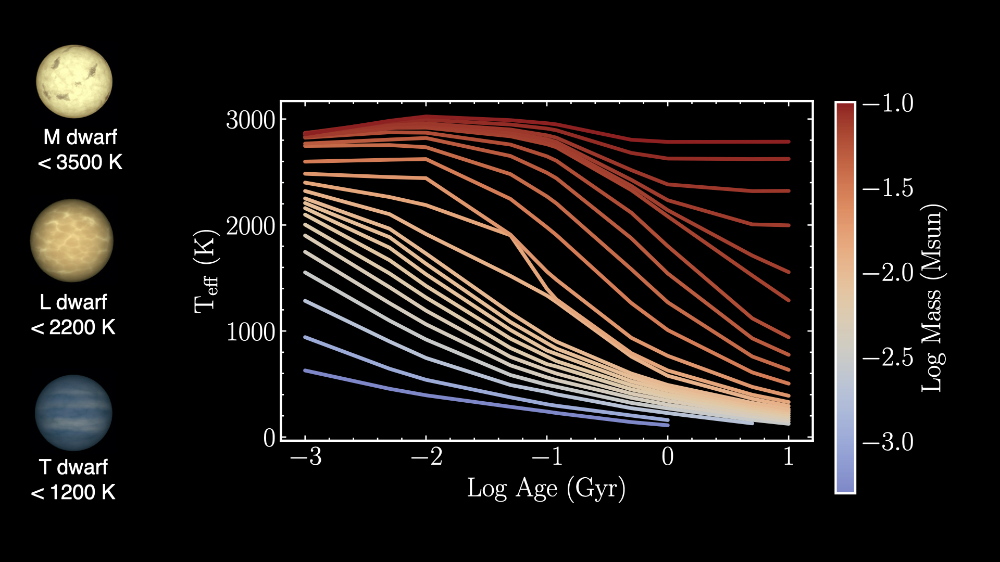
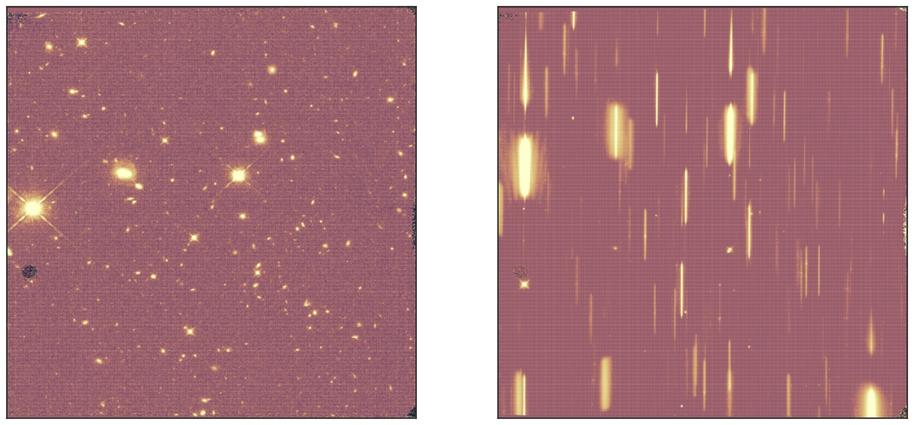
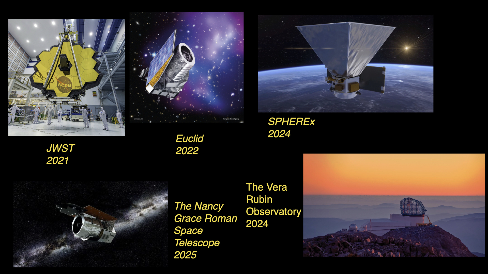

I am a PhD candidate at UC San Diego interested working with low-mass stars and brown dwarfs (ultracool dwarfs, UCDs). I'm part of the [Cool Stars Lab](http://pono.ucsd.edu/~adam/wordpress/) under Prof. Adam Burgasser. \\

UCDs are the lowest-mass objects (M<0.1 Msun) in the Milky Way, classified into spectral types M, L and T dwarfs. My research focuses on Galactic Archeology with UCDs, which involves measuring (or inferring) their scaleheight, age and mass distribution throughout the Galaxy. To accomplish this, I look for distant (~1 kpc) UCDs in deep surveys, namely the WISPS & 3D-HST surveys and run Monte-Carlo simulations including input distributions: initial mass function, star formation history, multiplicity statistics, Galactic structure and UCD evolutionary models to predict their number counts in these deep fields. \\

Evolutionary models of Burrrows et al. 2001 showing UCD evolution with time\
# UCDs in Deep HST Fields

[WISPS](http://wisps.ipac.caltech.edu/Background.html) and [3D-HST](https://archive.stsci.edu/prepds/3d-hst/) (Atek et al. 2010, Momcheva at al. 2016, Skelton et al. 2014) use HST/WFC3 (Kimble et al. 2008)  to obtain photometry and low-resolution (R≈130) near-infrared spectra of more than 250,000 sources. These surveys were designed to measure star-formation in high redshift galaxies (z>2) by measuring red shifted emission lines. The observations are taken in “parallel” mode, meaning that WFC3 operates concurrently with another instrument, allowing pointings in multiple directions, primarily at high Galactic latitudes (\lvert b \rvert ≥ 20 deg)

 Left: a processed image for a single pointing in the 3D-HST survey with the F160W filter (1.6 µm). The faintest stars in this image have F160W ≈26. Right: a G141 (1.1-1.7 µm) spectrum of the same pointing; the linear features are the dispersed spectra of each object. 

# Predicting Yields for the Next Generation of Surveys 
The next generation of wide-field surveys will detect millions of UCDs at distances up to ~10 kpc and will revolutionize the study of these objects as a Galactic population. The advances will be achieved by the next generation of survey facilities with greater sensitivities at longer wavelengths (e.g. SPHEREx to 5 µm, JWST to 28 µm), enabling studies of spectral features not previously explored. In addition, multi-epoch data will provide astromertic information that can be used to measure distances and isolate populations by their motions.\\

Predicting the science yields of these surveys requires predicting the UCD star counts and populations, and how they may vary based on different model assumptions. The purpose of this study is to evaluate the UCD yields for future surveys conducted with the James Webb Space Telescope, the Nancy Grace Roman Space Telescope, the Euclid Observatory, the Vera Rubin observatory, and SPHEREx for different assumptions about UCD population properties, Galactic structure, evolutionary, multiplicity, and metallicity, and determine which facilities are best suited for key UCD investigations. 

