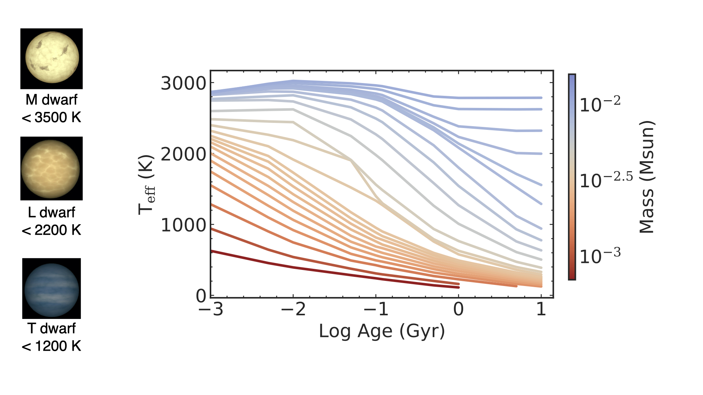

I am a final-year PhD candidate at UC San Diego interested in low-mass stars and brown dwarfs (ultracool dwarfs), galactic archaeology and dynamics and data science techniques for large surveys. I also work on gaps on globular cluster stellar streams as potential probes for dark matter. I am a part of the [Cool Stars Lab] (http://pono.ucsd.edu/~adam/wordpress/) under Prof. Adam Burgasser. 

---
# What are Ultracool Dwarfs?

UCDs are the lowest-mass objects (M<0.1 Msun; M, L, T, Y spectral types) in the Milky Way. Most galactic archeologists use bright F, G, K stars and/or giants to probe the formation history and evolution of our Galaxy, but UCDs present a potentially more enriching picture of Milky Way as they constitute a large fraction of stars in the Galaxy (~20-50% of all the stars). Some UCDs don't fuse Hydrogen in their cores so they cool down with time as they radiate away their internal heat. This cooling can serve as an additional ``clock" for galactic timescales. Additionally, they have strong molecular features that are highly sensitive to metallicity, providing another probe into galactic chemical abundances. 

These objects are extremely faint and hard to detect at large distances! Luckily, the next generation of large-scale surveys will revolutionize this field.

Evolutionary models of Baraffe et al. 2003 showing UCD evolution with time

---

# Galactic Archeology: Brown Dwarfs on a Galactic Scale

## Finding Brown Dwarfs and Low-mass Stars in Deep HST Fields with Machine Learning

In [Aganze et al. 2022a](https://arxiv.org/abs/2110.07672), we used traditional index-selection methods, and machine learning techniques (random forests and neural networks) to isolate a sample of 164 M7-T9 ultracool dwarfs up to distances of ~2~kpc in the Galaxy. Similar surveys with JWST (such as the PASSAGES survey) will uncover a comparable number of objects in the galactic thick disk and halo.

 Top Left: Cutout from a processed image of an L dwarf in the WISP survey with the F140W filter (1.4 µm). Top Right: a 2D G141 (1.1-1.7 µm) spectrum of the same pointing. Bottom: 1D- Spectrum fitted to best-match spectral templates of dwarfs and metal-poor subdwarfs.

---
Additional links:

  * [Link to paper](https://arxiv.org/abs/2110.07672)
  * Link to CoolStars Poster: [Finding Ultracool Dwarfs in Deep HST-WFC3 Surveys with Machine Learning](https://zenodo.org/record/4566990#.YR_e0tNKj0o)
  * [ADS Link to Paper](https://ui.adsabs.harvard.edu/abs/2022ApJ...924..114A/abstract)

## Scaleheights and Ages Brown Dwarfs and Low-mass Stars in Deep HST Fields with Machine Learning

In [Aganze et al. 2022b](https://arxiv.org/abs/2204.07621), we used the sample from Aganze et al. 2022a to constrain the scaleheight and ages using a simulation that takes into account the stellar mass function, multiplicity, UCD evolutionary models, galactic structure and survey selection function. We found that late-M dwarfs are generally older than L and T dwarfs as expected from cooling models, with median ages ranging from 3.6-2.4 Gyr.

Figure from the paper showing the simulated age (blue) vs inferred age (green) of UCD sub-populations. Dots show the median age of a population.

## Predicting Yields for the Next Generation of Surveys 

The next generation of wide-field surveys will detect millions of UCDs at distances up to ~10 kpc and will revolutionize the study of these objects as a Galactic population. The advances will be achieved by the next generation of survey facilities with greater sensitivities at longer wavelengths (e.g. SPHEREx to 5 µm, JWST to 28 µm), enabling studies of spectral features not previously explored. Multi-epoch data will also provide astrometric information that can be used to measure distances and isolate populations by their motions.

Predicting the science yields of these surveys requires predicting the UCD star counts and populations, and how they may vary based on different model assumptions. The purpose of this study is to evaluate the UCD yields for future surveys conducted with the James Webb Space Telescope, the Nancy Grace Roman Space Telescope, the Euclid Observatory, the Vera Rubin observatory, and SPHEREx for different assumptions about UCD population properties, Galactic structure, evolutionary, multiplicity, and metallicity, and determine which facilities are best suited for key UCD investigations. 

Links

  * [Link to AAS poster](https://aas237-aas.ipostersessions.com/default.aspx?s=2D-37-9B-ED-84-A3-58-9C-39-DB-DE-0B-A2-13-B7-27)
  * Paper for LSST (Rubin) in prep.
  * Paper for Roman in prep.

---
# Galactic Dynamics: Gaps in Globular Cluster Stellar Streams 

Cosmological simulations that include dark matter predict the existence of low-mass subhalos. These subhalos can perturb thin stellar streams formed by tidal disruption of globular clusters, creating a gap-like feature like those detected in Gaia data (e.g GD-1). I predict the detectability of these gaps in nearby galaxies with the Nancy Grace Roman Telescope. 

This research is done in collaboration with [Dr. Sarah Pearson](http://drsarahpearson.com/), [Dr. Tjitske Starkenburg](https://tstarkenburg.github.io/) and [Prof. Kathryn V. Johnston](http://user.astro.columbia.edu/~kvj/) and it started at the summer school on Galactic dynamics held in 2021 at the Flatiron Institute in NYC

Links
  * [Link to talk](https://www.youtube.com/watch?v=maYUxaOCOHA&list=PLWAzLum_3a180ECznso6HvwstZthGSoEZ&index=21&ab_channel=SimonsFoundation)
  * [Link to poster] (https://aas240-aas.ipostersessions.com/default.aspx?s=FD-DE-2C-7A-99-88-0A-A3-D6-85-C8-3D-3D-72-B8-BB&guestview=true)
  * Paper in prep

This gif shows a simulation of a stellar stream in our Galaxy being perturbed by a 10^9 solar mass subhalo. It's made using the [Gala code](http://gala.adrian.pw/en/latest/) 

----

# Local M Dwarfs

## Metal Poor GJ 660.1AB System 

I'm also interested in the study of nearby UCDs. GJ 660.1AB is a binary system (M1 and M7 secondary) previously overlooked; in [Aganze et al. 2016](https://arxiv.org/abs/1512.08659), we showed that the peculiarities in the spectrum of the secondary can be explained by its low metallicity. 

Moderate resolution SpeX SXD spectrum of the primary showing prominent atomic and molecular features in its atmosphere

# Machine Learning Projects

I have previously mentored and I am currently involved in training UCSD undergraduate students on summer projects that involve using supervised learning techniques (random forests and neural networks) to classify brown dwarfs and to identify rare populations (binaries, subdwarfs). 

Links 
  * Research Notes from Last Summer
    - [Gong et al. 2022](https://iopscience.iop.org/article/10.3847/2515-5172/ac6521)
    - [Gutierrez et al. 2022] (https://iopscience.iop.org/article/10.3847/2515-5172/ac6522)
  * Research Note on spectral binaries (in prep)

