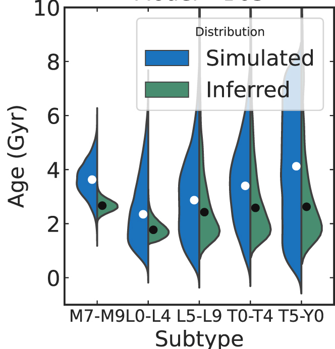

# Gaps in Globular Cluster Stellar Streams as Probes for Dark Matter in M31 and Other Galaxies

Cosmological simulations that include dark matter predict the existence of low-mass subhalos. These subhalos can perturb thin stellar streams formed by tidal disruption of globular clusters, creating a gap-like feature like those detected in Gaia data (e.g GD-1). I predict the detectability of these gaps in nearby galaxies with the Nancy Grace Roman Telescope. 

This research is done in collaboration primarily  with [Dr. Sarah Pearson](http://drsarahpearson.com/) and [Dr. Tjitske Starkenburg](https://tstarkenburg.github.io/)

Links
  * [Link to paper](https://arxiv.org/abs/2305.12045)

This gif shows a simulation of a stellar stream in our Galaxy being perturbed by a 10^8 solar mass subhalo. It's made using the [Gala code](http://gala.adrian.pw/en/latest/) 

---
# Galactic Archeology wuth Brown Dwarfs at Large Distances 

## Finding Brown Dwarfs and Low-mass Stars in Deep HST Paraellel Fields with Machine Learning

In [Aganze et al. 2022a](https://arxiv.org/abs/2110.07672), we used traditional index-selection methods, and machine learning techniques (random forests and neural networks) to isolate a sample of 164 M7-T9 ultracool dwarfs up to distances of ~2~kpc in the Galaxy. Similar surveys with JWST (such as the PASSAGES survey) will uncover a comparable number of objects in the galactic thick disk and halo.

 Top Left: Cutout from a processed image of an L dwarf in the WISP survey with the F140W filter (1.4 µm). Top Right: a 2D G141 (1.1-1.7 µm) spectrum of the same pointing. Bottom: 1D- Spectrum fitted to best-match spectral templates of dwarfs and metal-poor subdwarfs.

---
Links:

  * Link to CoolStars Poster: [Finding Ultracool Dwarfs in Deep HST-WFC3 Surveys with Machine Learning](https://zenodo.org/record/4566990#.YR_e0tNKj0o)
  * [ADS Link to Paper](https://ui.adsabs.harvard.edu/abs/2022ApJ...924..114A/abstract)

## Scaleheights and Ages Brown Dwarfs and Low-Mass Stars in Deep HST Parallel Fields

In [Aganze et al. 2022b](https://arxiv.org/abs/2204.07621), we used the sample from Aganze et al. 2022a to constrain the scaleheight and ages using a simulation that takes into account the stellar mass function, multiplicity, UCD evolutionary models, galactic structure and survey selection function. We found that late-M dwarfs are generally older than L and T dwarfs as expected from cooling models, with median ages ranging from 3.6-2.4 Gyr.

Figure from the paper showing the simulated age (blue) vs inferred age (green) of UCD sub-populations. Dots show the median age of a population.

# Local M Dwarfs

## Metal Poor GJ 660.1AB System 

I'm also interested in the study of nearby UCDs. GJ 660.1AB is a binary system (M1 and M7 secondary) previously overlooked; in [Aganze et al. 2016](https://arxiv.org/abs/1512.08659), we showed that the peculiarities in the spectrum of the secondary can be explained by its low metallicity. 

Moderate resolution SpeX SXD spectrum of the primary showing prominent atomic and molecular features in its atmosphere

# Machine Learning Projects

I have mentored UCSD undergraduate students on summer projects that involve using supervised learning techniques (random forests and neural networks) to classify brown dwarfs and to identify rare populations (binaries, subdwarfs). 

Links:
    * [Gong et al. 2022](https://iopscience.iop.org/article/10.3847/2515-5172/ac6521): Color Classification with SDSS, UKIDSS, and WISE Photometry 
    * [Gutierrez et al. 2022](https://iopscience.iop.org/article/10.3847/2515-5172/ac6522): Color Classification with PanSTARRS, 2MASS, UKIDSS, and WISE 
    * [Desai et al. 2023](https://iopscience.iop.org/article/10.3847/2515-5172/acb54a): classifying spectral binaries with machine learning

